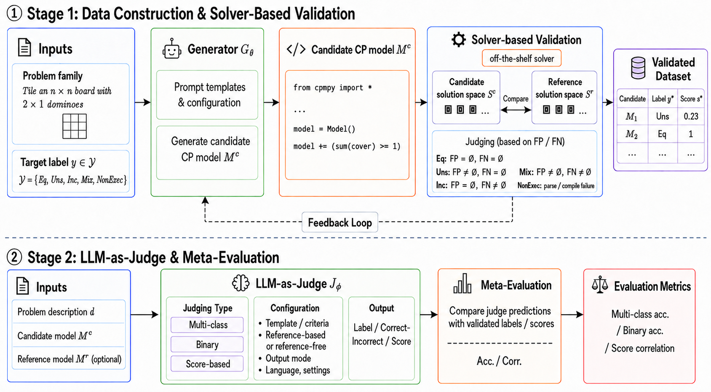
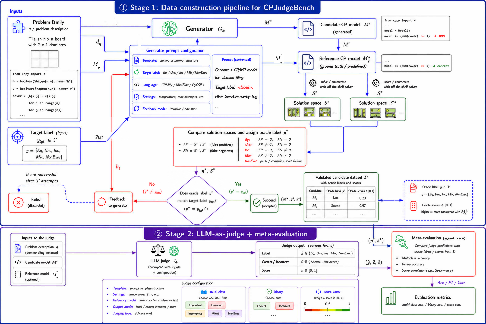
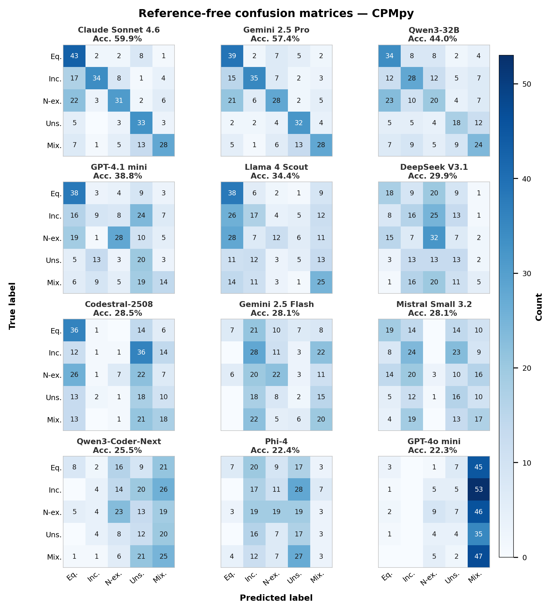
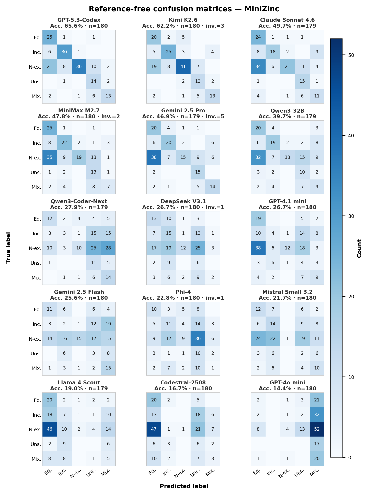

# CPJudgeBench

Official repository for the **EMNLP 2026 Main Conference** paper:

**[CPJudgeBench: Meta-Evaluation of LLM Judges for Constraint Programming through Solution-Space Semantics](paper/CPJudgeBench.pdf)**

[](https://2026.emnlp.org/)
[](paper/CPJudgeBench.pdf)
[](https://openreview.net/forum?id=E7ImNiglWw)
[](LICENSE)


**Nastaran Moradzadeh Farid**<sup>1</sup>, **Alireza Taghizadeh**<sup>2</sup>, **Tommaso Di Noia**<sup>3</sup>, **Yashar Deldjoo**<sup>3</sup>, **Sara Shafiee**<sup>1</sup>

<sup>1</sup>Technical University of Denmark  <sup>2</sup>Configit A/S  <sup>3</sup>Politecnico di Bari


**Paper:** [PDF](paper/CPJudgeBench.pdf) · [OpenReview](https://openreview.net/forum?id=E7ImNiglWw)

The ACL Anthology record will be linked here once the proceedings are published.

## Abstract

Large Language Models (LLMs) are increasingly used as evaluators for code generation, but existing judge benchmarks mainly target general-purpose programming. Constraint Programming (CP) requires a stricter notion of correctness: a model is correct only if it faithfully represents the intended solution space, not merely if it executes, preserves satisfiability, or returns one valid solution. We introduce **CPJudgeBench**, a benchmark for meta-evaluating LLM judges of CP modeling correctness through solver-supported solution-space semantics. It contains 522 solver-validated candidate models from 82 CP problem families in CPMpy and MiniZinc, labeled as equivalent, unsound, incomplete, mixed, or non-executable. Across our experiments, we meta-evaluate a total of 15 LLM judges through semantic-label, binary-correctness, and score-based protocols. Results show that fine-grained semantic judging remains difficult, especially for reference-free MiniZinc, while stronger reasoning- and code-oriented models perform more reliably. Score-based LLM judgments also align better with solution-space similarity than standard text or code metrics.

The pipeline (1) generates candidate CP models in multiple languages, (2) validates them against a reference model via solution-space enumeration, and (3) asks judge LLMs to classify or score those candidates.

**Overview.** Stage 1 constructs solver-validated candidates; Stage 2 meta-evaluates LLM judges against those oracle labels.



**Detailed pipeline.** Label-conditioned generation, solution-space oracle, and judge protocols (multi-class, binary, and score-based).



[High-resolution PDF](figures/framework_v6.pdf)

## Setup

```bash
python -m venv .venv
source .venv/bin/activate   # Windows: .venv\Scripts\activate
pip install -r requirements.txt
```

Create a `.env` file with your OpenRouter key:

```
OPENROUTER_API_KEY=...
```

You also need **CPMpy** (Python) and **MiniZinc** on `PATH` for model execution.

## Quick start

Run all steps on one sample problem (falls back to built-in `domino_tiling` if no problem file is found):

```bash
python main.py --num-problems 1
```

Or use the bundled sample input:

```bash
python main.py \
  --problems-file sample-data/domino_tiling-problem.jsonl \
  --problem-ids domino_tiling \
  --data-generation \
  --judge --judge-approach reference_free
```

## Pipeline steps

| Flag | What it does |
|------|----------------|
| `--generate-instances` | LLM-generated benchmark instances |
| `--data-generation` | Generate + validate candidate models per correctness label |
| `--judge` | LLM-as-judge evaluation (`--judge-approach` selects variant) |
<!-- | `--pairwise-judge` | Pairwise comparison of candidates |
| `--sat-meta-eval` | SAT-only meta-evaluation baseline | -->

Judge approaches: `reference_free`, `reference_based`, `score_reference_free`, `score_reference_based`, `binary_reference_free`, `binary_reference_based`.

Configure generator and judge models in `src/config.py`.

## Output layout

```
data-storage/<problem_id>/
  instances/           # generated instances
  candidates/
    candidate-models.json                    # plain payload for judges
    candidate-models-data-generation.json    # full generation metadata
    judge-results.csv
    judge-summary.csv
```

Progress/resume state is tracked under `logs/`.

## Sample data

A trimmed snapshot for the `domino_tiling` problem lives in [`sample-data/`](sample-data/). See [`sample-data/README.md`](sample-data/README.md) for file descriptions.

**The complete benchmark dataset will be shared in a future release.**

## Project structure

```
main.py              # entry point
src/
  main.py            # argument parsing and pipeline orchestration
  config.py          # experiment context and model lists
  data_generation.py # candidate generation + validation loop
  judge.py           # LLM-as-judge evaluation
  executors.py       # run models and enumerate solution spaces
  generation.py      # LLM prompts for instances and candidates
  llm.py             # OpenRouter client
preprocess_dcp_open.py   # optional preprocessing of DCP-Bench-Open problems
```


## Pointwise judge results

Accuracy (%) for reference-free (**RF**) and reference-based (**RB**) judging.  
Per-label results report accuracy within each ground-truth class:

- **Eq**: equivalent
- **Uns**: unsound
- **Inc**: incomplete
- **Mix**: unsound and incomplete
- **NonExec**: non-executable

### CPMpy — Reference-free

| Judge | Overall | Eq | Uns | Inc | Mix | NonExec |
|---|---:|---:|---:|---:|---:|---:|
| Claude Sonnet 4.6 | 59.9 | 76.8 | 75.0 | 53.1 | 51.9 | 48.4 |
| DeepSeek V3.1 | 29.9 | 31.6 | 29.5 | 25.0 | 9.4 | 50.8 |
| Gemini 2.5 Flash | 28.1 | 12.3 | 4.5 | 43.8 | 37.7 | 34.9 |
| Gemini 2.5 Pro | 57.4 | 69.6 | 72.7 | 54.7 | 51.9 | 43.8 |
| Llama 4 Scout | 34.4 | 67.9 | 11.4 | 26.6 | 46.3 | 18.8 |
| Phi-4 | 22.4 | 12.3 | 38.6 | 26.6 | 5.7 | 30.2 |
| Codestral 2508 | 28.5 | 63.2 | 40.9 | 1.6 | 34.0 | 11.1 |
| Mistral Small 3.2 | 28.1 | 33.3 | 36.4 | 37.5 | 32.1 | 4.8 |
| GPT-4.1 mini | 38.8 | 66.7 | 45.5 | 14.1 | 26.4 | 44.4 |
| GPT-4o mini | 22.3 | 5.4 | 9.1 | 0.0 | 87.0 | 14.1 |
| Qwen3-32B | 44.0 | 60.7 | 40.9 | 43.8 | 44.4 | 31.2 |
| Qwen3-3-Coder-Next | 25.5 | 14.3 | 27.3 | 6.2 | 46.3 | 35.9 |

### CPMpy — Reference-based

| Judge | Overall | Eq | Uns | Inc | Mix | NonExec |
|---|---:|---:|---:|---:|---:|---:|
| Claude Sonnet 4.6 | 68.8 | 78.6 | 86.4 | 75.0 | 57.4 | 51.6 |
| DeepSeek V3.1 | 54.1 | 82.5 | 59.1 | 54.7 | 30.2 | 44.4 |
| Gemini 2.5 Flash | 49.1 | 70.2 | 29.5 | 45.3 | 41.5 | 54.0 |
| Gemini 2.5 Pro | 70.9 | 85.7 | 86.4 | 79.7 | 59.3 | 48.4 |
| Llama 4 Scout | 51.4 | 83.9 | 36.4 | 50.0 | 59.3 | 28.1 |
| Phi-4 | 38.4 | 59.6 | 56.8 | 21.9 | 32.1 | 28.6 |
| Codestral 2508 | 43.4 | 82.5 | 52.3 | 15.6 | 47.2 | 27.0 |
| Mistral Small 3.2 | 47.3 | 73.7 | 52.3 | 50.0 | 52.8 | 12.7 |
| GPT-4.1 mini | 48.4 | 84.2 | 36.4 | 46.9 | 30.2 | 41.3 |
| GPT-4o mini | 29.8 | 19.6 | 22.7 | 0.0 | 90.7 | 21.9 |
| Qwen3-32B | 64.2 | 82.1 | 79.5 | 68.8 | 51.9 | 43.8 |
| Qwen3-Coder-Next | 40.1 | 66.1 | 38.6 | 21.9 | 46.3 | 31.2 |

### MiniZinc — Reference-free

| Judge | Overall | Eq | Uns | Inc | Mix | NonExec |
|---|---:|---:|---:|---:|---:|---:|
| Claude Sonnet 4.6 | 49.7 | 88.9 | 88.2 | 48.6 | 50.0 | 27.6 |
| DeepSeek V3.1 | 26.7 | 48.1 | 35.3 | 40.5 | 9.1 | 15.6 |
| Gemini 2.5 Flash | 25.6 | 40.7 | 17.6 | 5.4 | 68.2 | 19.5 |
| Gemini 2.5 Pro | 46.9 | 74.1 | 88.2 | 54.1 | 63.6 | 19.7 |
| Llama 4 Scout | 19.0 | 74.1 | 0.0 | 18.9 | 22.7 | 2.6 |
| Phi-4 | 22.8 | 37.0 | 58.8 | 29.7 | 4.5 | 11.7 |
| Codestral 2508 | 16.7 | 74.1 | 35.3 | 0.0 | 13.6 | 1.3 |
| Mistral Small 3.2 | 21.7 | 44.4 | 11.8 | 37.8 | 45.5 | 1.3 |
| GPT-4.1 mini | 26.7 | 70.4 | 23.5 | 10.8 | 40.9 | 15.6 |
| GPT-4o mini | 14.4 | 7.4 | 0.0 | 0.0 | 90.9 | 5.2 |
| Qwen3-32B | 39.7 | 74.1 | 58.8 | 51.4 | 40.9 | 17.1 |
| Qwen3-Coder-Next | 27.9 | 44.4 | 64.7 | 8.1 | 63.6 | 13.2 |

### MiniZinc — Reference-based

| Judge | Overall | Eq | Uns | Inc | Mix | NonExec |
|---|---:|---:|---:|---:|---:|---:|
| Claude Sonnet 4.6 | 48.0 | 77.8 | 94.1 | 43.2 | 63.6 | 25.0 |
| DeepSeek V3.1 | 30.3 | 77.8 | 47.1 | 14.3 | 9.1 | 23.0 |
| Gemini 2.5 Flash | 31.4 | 59.3 | 17.6 | 40.0 | 45.5 | 16.2 |
| Gemini 2.5 Pro | 48.6 | 92.6 | 94.1 | 59.5 | 54.5 | 15.8 |
| Llama 4 Scout | 24.6 | 81.5 | 41.2 | 21.6 | 31.8 | 0.0 |
| Phi-4 | 21.7 | 59.3 | 47.1 | 8.6 | 9.1 | 12.2 |
| Codestral 2508 | 20.0 | 81.5 | 23.5 | 0.0 | 40.9 | 0.0 |
| Mistral Small 3.2 | 22.3 | 74.1 | 17.6 | 14.3 | 50.0 | 0.0 |
| GPT-4.1 mini | 30.9 | 85.2 | 58.8 | 31.4 | 22.7 | 6.8 |
| GPT-4o mini | 16.2 | 18.5 | 17.6 | 0.0 | 90.9 | 1.3 |
| Qwen3-32B | 39.1 | 77.8 | 64.7 | 54.1 | 50.0 | 9.2 |
| Qwen3-Coder-Next | 28.5 | 81.5 | 76.5 | 5.4 | 31.8 | 9.2 |

## Confusion matrices





## Problem input

Problems are JSONL records with fields: `id`, `description`, `model`, `example_instance`, `decision_variables`, `instances`. Place your full problem file at `extra_files/dcp-bench-open.jsonl` (gitignored) or pass `--problems-file`.

The 82 problem families in the paper are drawn from [DCP-Bench-Open](https://github.com/DCP-Bench/DCP-Bench-Open).

## Citation

If you use this repository or the benchmark, please cite:

```bibtex
@inproceedings{moradzadeh-farid-etal-2026-cpjudgebench,
  title     = {{CPJudgeBench}: Meta-Evaluation of {LLM} Judges for Constraint Programming through Solution-Space Semantics},
  author    = {Moradzadeh Farid, Nastaran and Taghizadeh, Alireza and Di Noia, Tommaso and Deldjoo, Yashar and Shafiee, Sara},
  booktitle = {Proceedings of the 2026 Conference on Empirical Methods in Natural Language Processing},
  month     = oct,
  year      = {2026},
  address   = {Budapest, Hungary},
  publisher = {Association for Computational Linguistics},
}
```

## Acknowledgements

This work was supported by the Independent Research Fund Denmark (DFF), grant ID [10.46540/3163-00006B](https://doi.org/10.46540/3163-00006B).


## Contact

Questions about the paper or this repository: [nmofa@dtu.dk](mailto:nmofa@dtu.dk), or open a [GitHub issue](https://github.com/Nastaran95/CPJudgeBench/issues).
